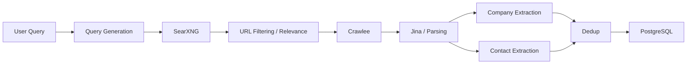

# GTM

GTM is a B2B go-to-market platform for discovering companies and the people who work at them from the open web, then turning that raw data into actionable prospect lists.

Today the project consists of a single backend service — the **Prospect Engine** — which finds companies matching a query and extracts their key contacts. The frontend does **not** exist yet.

## What the Prospect Engine does today

Given a natural-language query (for example, *"Find Indian companies in the solar industry that use SAP"*), the engine:

1. Generates a set of concrete web-search queries.
2. Searches the web via SearXNG.
3. Filters and ranks the results for relevance.
4. Crawls the surviving company websites.
5. Parses each page to extract company details and contact people.
6. Deduplicates people across sources.
7. Persists everything to PostgreSQL.

The result is a structured list of companies, each with its highest-confidence contacts and leadership roles, saved as JSON and stored in the database.

## Backend pipeline



| Stage | Component | Notes |
| --- | --- | --- |
| Query Generation | `discovery/queryGenerator.js` | Gemini builds a search plan; falls back to template queries when the LLM is disabled |
| Search | `sources/searxng/` | SearXNG + dork queries, with caching and domain dedupe |
| Relevance | `relevance/companyRelevance.js` | Deterministic filters (social/directory/search pages, non-HTML assets) then LLM classification/ranking |
| Crawl | `crawl/crawlers.js` | Crawlee `CheerioCrawler` with sitemap + internal-link discovery, robots.txt, rate limits, retries |
| Parsing | `parse/index.js` | Tiered: deterministic DOM → Jina markdown → local HTML→markdown → LLM |
| Company Extraction | `parse/`, `extraction/` | Company name, industry, products/services, technology signals |
| Contact Extraction | `parse/contact.js` | Names, titles, emails, phones, role categories |
| Dedup | `dedup/crossSource.js` | Merges people by email, phone, profile URL or exact name; fuzzy names become review candidates |
| Storage | `storage/` | PostgreSQL with SQL migrations |

## Implementation status

### Working

- End-to-end discovery → crawl → parse → extract → dedup → persist pipeline (CLI `src/index.js`).
- Query generation with Gemini and a non-LLM fallback.
- SearXNG discovery with dork queries, result caching, and domain dedupe.
- Deterministic URL filtering plus LLM relevance ranking.
- Crawlee crawling with sitemap and internal-link discovery, robots.txt, rate limiting, retries and backoff.
- Tiered page parsing (deterministic → Jina → local markdown → LLM).
- Company and contact extraction with confidence scoring.
- Cross-source person dedupe.
- PostgreSQL schema and migrations (`raw_pages`, `raw_records`, `crawl_targets`, `suppression`, `email_checks`).
- BullMQ/Redis job queue for discovery, crawl, and extraction.
- HTTP API: `/health`, `/ready`, `POST /discover`, `POST /crawl`, `POST /extract`, `GET /jobs/:id`.

### Partial / needs improvement

- **LLM company extraction with technology signals** (`extraction/companyExtractor.js`) is implemented but not wired into the main pipeline.
- **GitHub enrichment** (`github/`) — org matching, public members, repositories, tech hints — implemented but not wired into the pipeline.
- **MCA (India Ministry of Corporate Affairs) enrichment** (`mca/`) — company and director matching — implemented but not wired into the pipeline.
- **Email verification** — the `email_checks` table and `suppression` table exist, but verification is not yet implemented.
- **Fuzzy-name dedupe** only surfaces review candidates; it never auto-merges.

### Planned

- Next.js frontend (see below).
- Email verification.
- Personalization and outreach.
- CRM / GTM integration.
- Signals and enrichment at scale.
- Scaling and hardening of the queue and crawl infrastructure.

## Tech stack

| Layer | Technology |
| --- | --- |
| Runtime | Node.js 22 (ESM) |
| Database | PostgreSQL 16 (`pg`) |
| Queue | Redis 7 + BullMQ (`ioredis`) |
| Search | SearXNG |
| Crawling | Crawlee (`CheerioCrawler`) |
| Page parsing | Jina AI Reader (`r.jina.ai`) + Cheerio |
| LLM | Google Gemini (`@google/genai`) or OpenAI |
| Validation | `zod` |
| Config | `dotenv` |

## Running the Prospect Engine locally

The fastest path is Docker Compose, which brings up Postgres, Redis, SearXNG, the API, and the worker together.

```bash
cd prospectEngine
cp .env.example .env   # if an example file is provided; otherwise create .env
docker compose up --build
```

To run without Docker:

```bash
cd prospectEngine
npm install
npm run migrate        # apply SQL migrations
npm run api            # start the HTTP API on :3000
npm run worker         # start the BullMQ worker
npm start              # run the pipeline once via the CLI
```

Useful npm scripts: `test:parse`, `test:company`, `test:contact`, `test:dedup`, `test:discovery`, `test:relevance`, `test:health`, `test:api`.

## Environment variables

Configure these in `prospectEngine/.env`. Values shown here are names only — **never commit real secrets**.

| Variable | Purpose |
| --- | --- |
| `USER_QUERY` | The discovery query (e.g. *"Find Indian companies in the solar industry that use SAP"*) |
| `DATABASE_URL` / `DB_*` | PostgreSQL connection (host, port, name, user, password) |
| `REDIS_ENABLED`, `REDIS_URL` / `REDIS_*` | Redis / BullMQ queue connection |
| `SEARXNG_URL` | SearXNG endpoint |
| `LLM_ENABLED`, `LLM_PROVIDER` | Enable LLM and choose `gemini` or `openai` |
| `GEMINI_API_KEY` / `OPENAI_API_KEY` | LLM provider credentials (secrets) |
| `JINA_ENABLED`, `JINA_API_KEY` | Jina AI Reader for clean markdown |
| `GITHUB_TOKEN` | GitHub enrichment (secret) |
| `MCA_*` | MCA enrichment (endpoint, key) |
| `DISCOVERY_*`, `CRAWL_*`, `SEARCH_*` | Discovery, crawl, and search tuning (limits, concurrency, delays) |

Secrets such as API keys and passwords are read from the environment and never hardcoded.

## Planned architecture

The current system is backend-only. A **Next.js frontend** will be added later as a separate application under `Frontend/`. It will talk to the Prospect Engine's HTTP API and display discovered companies, contacts, and enrichment results.

> The frontend is **not implemented yet** — `Frontend/` is currently empty.

## Future GTM stages

Beyond the Prospect Engine, the broader GTM roadmap includes:

1. **Email verification** — validate contact emails (MX, catch-all, SMTP) before outreach.
2. **Personalization / outreach** — generate personalized messages and run outreach campaigns.
3. **CRM / GTM integration** — push verified prospects into CRMs and GTM tools.
4. **Signals** — intent and firmographic signals (technology usage, hiring, funding, GitHub activity, MCA filings).
5. **Scaling** — queue throughput, crawl capacity, caching, and multi-source ingestion.

## Project structure

```
GTM/
├── Frontend/          # Next.js frontend (planned, currently empty)
└── prospectEngine/    # Prospect Engine backend (Node.js)
    ├── src/
    │   ├── api/        # HTTP API server
    │   ├── bin/        # Entry points (api, worker)
    │   ├── channels/   # Search backend abstraction
    │   ├── crawl/      # Crawlee crawler + link/sitemap discovery
    │   ├── dedup/      # Cross-source person dedupe
    │   ├── discovery/  # Query generation + discovery service
    │   ├── extraction/ # LLM company extraction (tech signals)
    │   ├── github/     # GitHub enrichment
    │   ├── jobs/       # BullMQ queue + worker processors
    │   ├── lib/        # URL, dedupe, logging helpers
    │   ├── mca/        # MCA (India) enrichment
    │   ├── parse/      # Parsing tiers + contact/company extractors
    │   ├── relevance/  # URL filtering + relevance ranking
    │   ├── sources/    # Search sources (SearXNG)
    │   ├── storage/    # PostgreSQL access + migrations
    │   ├── config.js   # Environment-based configuration
    │   ├── health.js   # Health / readiness checks
    │   ├── index.js    # CLI single-run pipeline
    │   └── pipeline.js # Reusable extraction stage
    ├── test/           # Node test scripts
    ├── Dockerfile
    └── docker-compose.yml
```
